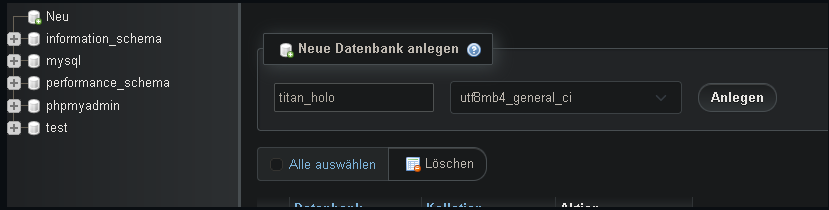

# LAP_CODING_PRAXIS
Ibo Haidars `CRUD Project`: https://gitlab.com/Ismail099/crud_template_project

> **Eine eigene Ausarbeitung mit Doku wird noch folgen.**


> **Die Ausarbeitung der Theorie kann [hier](https://github.com/LeonDiendorfer/LAP_Coding_Theorie) gefunden werden**

- `Git` - Um dieses Projekt und damit die Basis der Praxisprüfung zu klonen zur Not kann man den nötigen Code auch kopieren.
- `XAMPP` - Um den PHP Code auszuführen und die Datenbank zu hosten und zu bearbeiten via phpmyadmin.
- `Fleet` - Um den Code der Webseite zu bearbeiten.

In den ersten Schritten gehen wir die *Installation* gemeinsam durch.   
Abschließend zeigen wir euch wie man eine *Template Seite* erstellt.

---

### Erste Schritte der Datenbank

- `XAMPP` installieren  **(Link im Software Folder)**
- `Apache` und `MySQL` starten <br> 
- [PhpMyAdmin öffnen](http://localhost/phpmyadmin)
- DB anlegen (Neu-DB Name eingeben- Anlegen) <br> 

- Tabellen laut ER Diagram anlegen

---

### Erstellen einer Tabelle

```sql
CREATE TABLE Orders (
  OrderID int NOT NULL,
  OrderNumber int NOT NULL,
  PersonID int,
  PRIMARY KEY (OrderID),
  FOREIGN KEY (PersonID) REFERENCES Persons(PersonID)
);
```
*`FOREIGN KEY` nur hinzufügen wenn man abhängige Tabellen hat.* <br>
*Erst die Tabellen erstellen die keine `Foreign Keys` haben.*

<br> 
<br> Tabelle wurde erstellt, siehe nächster Screen
<br> 
<br>

### Befüllen einer Tabelle

```sql
INSERT INTO orders (`OrderID`,`OrderNumber`,`PersonID`) values
(2, 2, 2),
(3, 3, 3);
```

### Select

```sql
SELECT * FROM `orders` WHERE orderid = 1; 
```

### Update

```sql
UPDATE orders SET ordernumber = 420, personid = 69 WHERE OrderID = 1;
```

### Delete row

```sql
DELETE FROM orders WHERE OrderID = 1;
```

### Drop table

```sql
DROP TABLE orders;
```
*`Drop Table` von hinten. Erst die Tabellen droppen die keinen `Foreign Key` in anderen Tabellen haben!*

---
### Erste Schritte der Webseite <br>

1. Jetbrains Toolbox installieren für Website
**(Link im Software Folder)**


2. Fleet installieren <br> 

### Workspace auswählen
<br> 

`XAMPP` Folder auswählen.

```
D:\xampp\htdocs
```

### ada

### dada